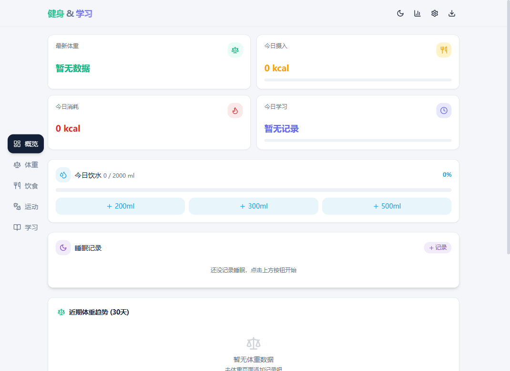
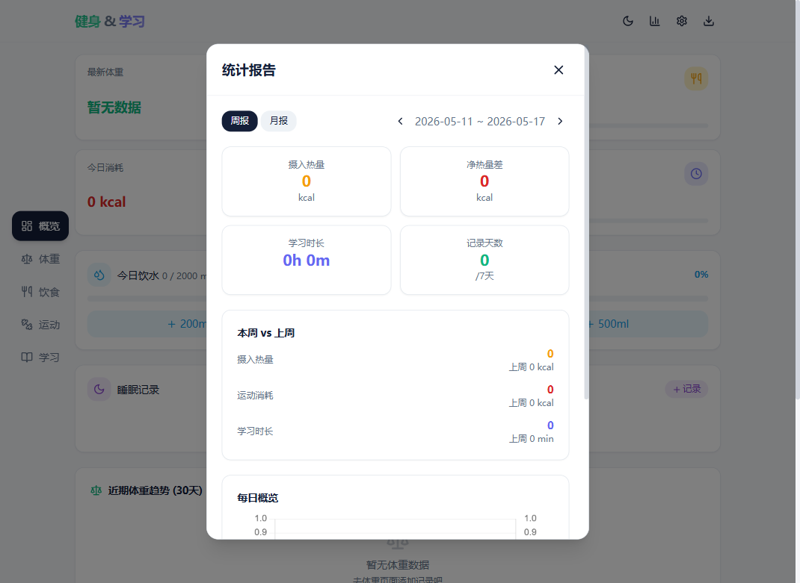
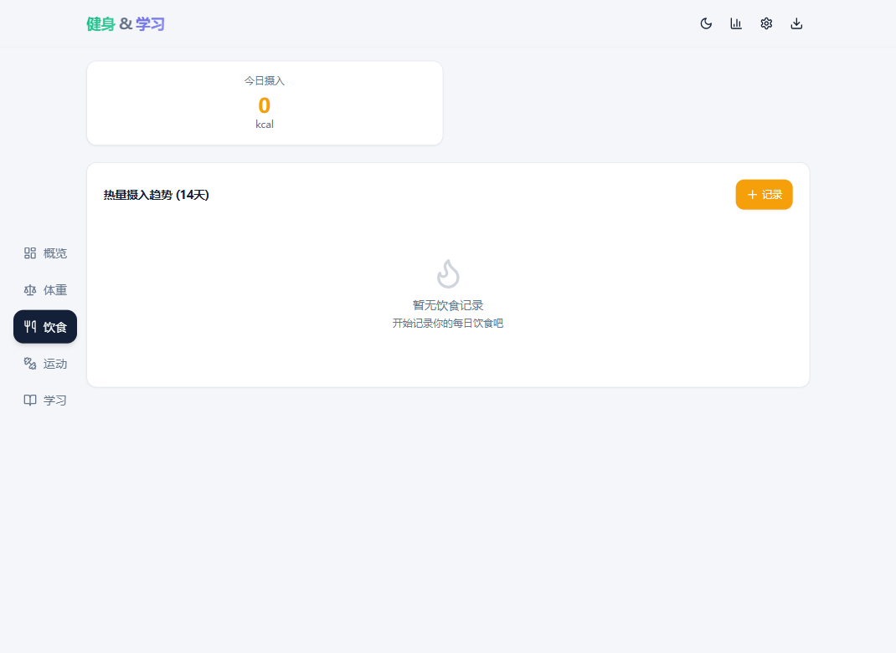

# Cognitive Crunch

一款集健身追踪与学习管理于一体的个人数据管理应用，帮助你同时保持身体健康和学业进步。



## 功能特性

- **概览仪表盘** — 一目了然查看今日体重、饮食热量、运动时长、学习进度、饮水量、睡眠及连续打卡天数
- **体重记录** — 记录每日体重与身体围度（腰围、臀围、胸围、臂围、腿围），Chart.js 趋势图可视化
- **饮食管理** — 按餐次（早餐/午餐/晚餐/加餐）记录食物，追踪热量、蛋白质、碳水、脂肪摄入，支持食物搜索
- **运动打卡** — 记录跑步、骑行、游泳、力量训练、HIIT、瑜伽等多种运动类型及消耗热量
- **学习追踪** — 按科目记录学习时长，内置番茄钟计时器，支持考试成绩记录与目标管理
- **饮水追踪** — 快捷记录每日饮水量（200/300/500ml 按钮），进度条可视化，可自定义目标
- **睡眠记录** — 记录入睡/起床时间与睡眠质量（5 级评价），自动计算时长与周均睡眠
- **统计报告** — 多维度数据图表分析，本周 vs 上周对比（热量、运动、学习），回顾健身与学习趋势
- **里程碑提醒** — 达成连续打卡等成就时自动通知
- **数据管理** — 支持数据导入/导出（JSON），一键清空
- **暗色模式** — 支持亮色/暗色主题切换，暗色模式输入框边框清晰可见
- **响应式设计** — 移动端底部导航栏 + 桌面端侧边栏，自适应布局

## 截图

| 概览仪表盘 | 统计报告 | 饮食管理 |
|---|---|---|
|  |  |  |

## 技术栈

- **框架**: React 18 + TypeScript
- **构建工具**: Vite 6
- **样式**: Tailwind CSS 3 + tailwindcss-animate
- **图表**: Chart.js 4
- **图标**: Lucide React
- **路由**: React Router DOM v7
- **数据存储**: localStorage + lz-string 压缩 + 自动聚合历史数据（3个月以上按周汇总）

## 快速开始

### 环境要求

- Node.js >= 18
- npm >= 9

### 安装与运行

```bash
# 克隆仓库
git clone https://github.com/hang-meng/Cognitive-Crunch.git
cd Cognitive-Crunch

# 安装依赖
npm install

# 启动开发服务器
npm run dev

# 构建生产版本
npm run build

# 预览生产构建
npm run preview
```

## 部署

### Cloudflare Pages（推荐）

1. 将代码推送到 GitHub 仓库
2. 登录 [Cloudflare Dashboard](https://dash.cloudflare.com/) → Workers & Pages
3. 点击 **创建应用程序** → **Pages** → **连接到 Git**
4. 选择你的 GitHub 仓库
5. 构建设置：
   - **构建命令**: `npm run build`
   - **构建输出目录**: `dist`
   - **Node.js 版本**: 18 或更高
6. 点击 **保存并部署**

部署完成后即可通过 `*.pages.dev` 域名访问，也可绑定自定义域名。

## 使用指南

### 概览仪表盘
打开应用进入概览页，顶部显示连续打卡天数，下方卡片依次展示今日关键指标。直接点击饮水 / 睡眠卡片中的按钮即可快捷记录。

### 体重记录
进入"体重"标签页，输入当天体重和围度数据。趋势图自动展示 30 天体重变化。

### 饮食管理
进入"饮食"标签页，点击"记录"按钮。支持两种输入方式：
- **搜索食物**: 输入食物名称从内置数据库中查找，自动填入热量和营养素
- **手动输入**: 直接填写食物名称、热量和营养成分

### 运动打卡
选择运动类型（跑步、骑行、游泳等），填写时长和消耗热量即可记录。

### 学习追踪
按科目（语文、数学、英语等）记录学习时长，内置 **番茄钟计时器** 辅助专注。还可录入模考成绩，设置每日学习目标。

### 统计报告
点击右上角图表图标查看周报 / 月报。周报模式下自动显示本周 vs 上周对比，绿色表示进步，红色表示退步。

### 数据备份
点击右上角下载图标 → **导出数据**，生成 JSON 文件保存到本地。换设备或重装系统后可通过 **导入数据** 恢复。

## 数据模型

### 记录类型

| 类型 | 字段 | 说明 |
|---|---|---|
| 体重记录 | date, weight, note | 每日体重（kg） |
| 围度记录 | date, waist, hip, chest, arm, thigh | 身体围度（cm） |
| 饮食记录 | date, mealType, foodName, calories, protein, carbs, fat | 按餐次记录 |
| 运动记录 | date, type, duration, calories | 8 种运动类型 |
| 学习记录 | date, subject, duration | 6 个科目 |
| 考试成绩 | date, subject, score, totalScore, examName | 模考成绩 |
| 饮水记录 | date, amount, note | 每日饮水量（ml） |
| 睡眠记录 | date, bedTime, wakeTime, quality | 入睡/起床 + 5 级评价 |

### 存储策略

- **热存储**（90 天内）: 保留全部原始记录，精确到每餐、每次
- **冷存储**（90 天以上）: 自动按周聚合为摘要（周总量/周均值），删除原始明细
- **压缩**: 存入前用 lz-string 压缩，通常压缩至原大小的 15-30%
- 考试成绩和身体围度数据量小，永久保留原始记录

## 项目结构

```
src/
├── components/          # 通用组件
│   ├── ui/              # 基础 UI 组件（Button, Card）
│   ├── DataManager.tsx   # 数据导入/导出/清空弹窗
│   ├── FoodSearch.tsx    # 食物搜索组件
│   ├── MilestoneNotification.tsx  # 里程碑通知
│   ├── Modal.tsx         # 通用弹窗
│   ├── PomodoroTimer.tsx # 番茄钟计时器
│   └── Toast.tsx         # 轻提示组件
├── lib/
│   ├── store.ts          # 数据模型、localStorage 存取与业务逻辑
│   └── utils.ts          # 工具函数
├── pages/
│   ├── DashboardPage.tsx # 概览页
│   ├── WeightPage.tsx    # 体重记录页
│   ├── DietPage.tsx      # 饮食管理页
│   ├── ExercisePage.tsx  # 运动打卡页
│   ├── StudyPage.tsx     # 学习追踪页
│   ├── ReportPage.tsx    # 统计报告页
│   └── SettingsPage.tsx  # 设置页
├── App.tsx               # 应用主入口与布局
├── index.css             # 全局样式与 Tailwind 指令
├── main.tsx              # 渲染入口
└── vite-env.d.ts         # Vite 类型声明
```

## 数据说明

所有数据存储在浏览器 localStorage 中，不上传至任何服务器。采用 lz-string 压缩（通常压缩至 15-30%），超过 3 个月的原始数据自动按周聚合为摘要保留，大幅提升存储效率。支持通过 JSON 文件进行数据备份与迁移，确保你的数据始终掌握在自己手中。

## 浏览器兼容性

| 浏览器 | 最低版本 | 备注 |
|---|---|---|
| Chrome / Edge | 90+ | 推荐 |
| Firefox | 90+ | 完全支持 |
| Safari | 15+ | iOS / macOS |
| 移动端浏览器 | iOS 15+ / Android Chrome 90+ | 响应式布局适配 |

## 更新日志

### v2.2 (2026-05)
- 🔒 localStorage lz-string 压缩 + 90 天自动聚合历史数据
- 🎨 暗色模式输入框边框优化
- 🐛 修复报告弹窗关闭按钮图标

### v2.1 (2026-05)
- 📊 周报新增本周 vs 上周对比视图
- 😴 睡眠记录功能（时长 + 质量评价）
- 🥤 饮水量追踪功能
- 🚀 Dashboard 性能优化（消除重复 localStorage 读取）

### v2.0 (2026-05)
- ⚡ 弹窗卡顿修复（useMemo + 移除 backdrop-blur）
- 🎨 UI 全面优化

## License

MIT
